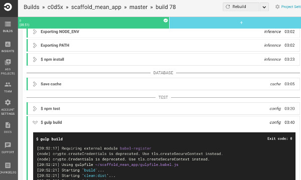

# CircleCI vs TravisCI vs CodeShip vs Jenkins

## Abstract
The idea for this document is to help you decide which of these four Continuous Integration systems to use depending on
your priorities, using an scaffold application created with [a
generator](https://github.com/DaftMonk/generator-angular-fullstack). The application uses `nodejs 4.4.6`, `npm`, `gulp`
and connects to `mongod`. This document does not cover the delivery process.

## Summary
Continuous Integration and Unit Testing are two critical processes in the development life cycle of every software
project, so the question is not if it should be done, but how it should be done. Luckily there are plenty of options
available for free(for open source projects). This comparison shows how easy/hard it was to make each option work, and
what considerations you should have when you deploy a similar application.

## Evaluation Method
The following aspects are evaluated on each system:

1. **Initial Setup**: Complexity for creating the project and running basic tests
2. **Services**: Complexity for connecting services, mongod in this case
3. **Performance**: Considered as time it takes to run the operations
4. **UI/UX**: Satisfaction in the opinion of the author
5. **Pricing** (although evaluation used free offerings only)

Each system is going to be configured so that builds are triggered when changes are committed, then performance and UI/UX is evaluated. Ten iterations will be considered to get the average performance without changing the code.

## Test Program
These operations are considered as standard to build the application:

### Preparation
1. rm -rf node_modules
2. npm install --no-optional

### Unit Testing
1. npm test

### Build
1. gulp build

Some systems require additional operations like installing underlying software, that time is considered as part of their performance evaluation.

## CircleCI

### Initial Setup
Sign up requires only to authorize CircleCI against Github, then it shows you the list of repositories so you can create the project with a click. The system looks for a file called [circle.yml](https://github.com/c0d5x/scaffold_mean_app/blob/master/circle.yml) to determine what steps conform the build. The [documentation](https://circleci.com/docs/configuration/) is very helpful, providing many examples for the most common languages and features. Setting the node version only requires a statement.
**Rating: 10**

### Services
CircleCI provides many services out of the box, bounded to localhost, the list includes `Postgres, MySQL, MongoDB, Cassandra, redis, elasticsearch, rabbit-mq`, etc, so for this application nothing is required.
**Rating: 10**

### Performance
|Iteration|1|2|3|4|5|6|7|8|9|10|Average|
|---------|:-:||||||||||------:|
||1.1|1.2|1.3|1.4|1.5|1.6|1.7|1.8|1.9|2.0|**1.5**|

### UI/UX

#### Main Window
The main page is informative, showing a list of the latest builds with the commit message, time ago and time it took.
 

This page is responsive but in my opinion it doesn't adapt well enough when the width is reduced because the repository list is kept at the same width occupying empty space below the repo name.

#### Build Window
Each command is captured in a panel that is collapsed once the command has completed. Scrolling to the bottom of the page will keep it autoscrolling.

#### ANSI Support
CircleCI correctly supports ANSI codes for different colors.

#### Mobile
The same responsive view is shown on mobile devices, which doesn't use space appropriately.

**UI/UX Rating: 8**

#### Pricing
1. Free for 1 job, 1 container
2. $150 for 4 containers
3. $350 for 8 containers

## Travis CI

### Initial Setup
The first thing to learn about TravisCI is that there are two sites: [Travis-CI.com](https://travis-ci.com/) for enterprise clients and [Travis-CI.org](https://travis-ci.org/) for open source projects. Next a big delay was to find out that Travis comes with a really old C++ compiler that doesn't support [C++11](https://en.wikipedia.org/wiki/C%2B%2B11). This is important because `nodejs` and many other languages compile libraries/gems using C++, so you will get strange errors that don't seem to relate to your code. Considering that, you will add a file called [.travis.yml](https://github.com/c0d5x/scaffold_mean_app/blob/master/.travis.yml) to your repo and Travis will start triggering builds when code is commited to Github.
**Rating: 7**

### Services
Services in Travis work similar to CircleCI with the exception that in Travis these are not started by default, so you need to specify which services you want load from this list: `MySQL, Postgres, MariaDB, MongoDB, CouchDB, RabbitMQ, memcached, Redis, Cassandra, Neo4j, ElasticSearch, RethinkDB`, etc, and for each of these Travis support a number of versions.
**Rating: 10**

### Performance

The time shown here includes installing a new compiler as noted above.

|Iteration|1|2|3|4|5|6|7|8|9|10|Average|
|---------|:-:||||||||||------:|
||1.1|1.2|1.3|1.4|1.5|1.6|1.7|1.8|1.9|2.0|**1.5**|

### UI/UX

#### Main Page
The main page shows the latest build so which is very useful. As CircleCI it shows time ago, commit message and commit id, but also a link to compare the last changes which is very useful too.

The same view adapts correctly when reduced in width:

It has autoscrolling and refreshes nicely.

#### ANSI Support
Travis CI does support ANSI codes.

#### Mobile
The responsive view adapts correctly on mobile devices.

**UI/UX Rating: 10**